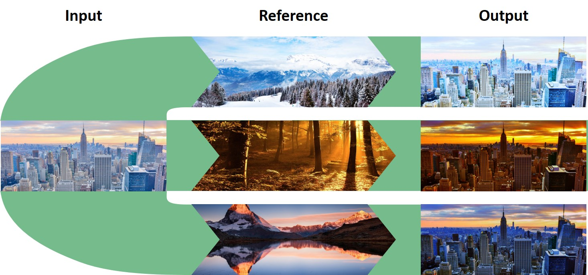
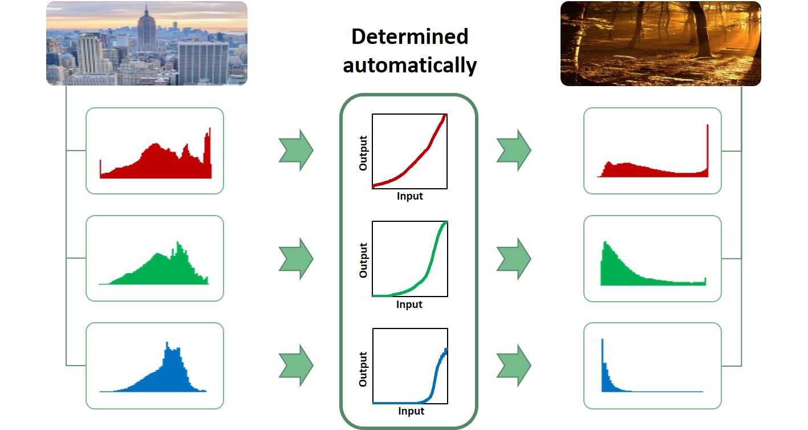
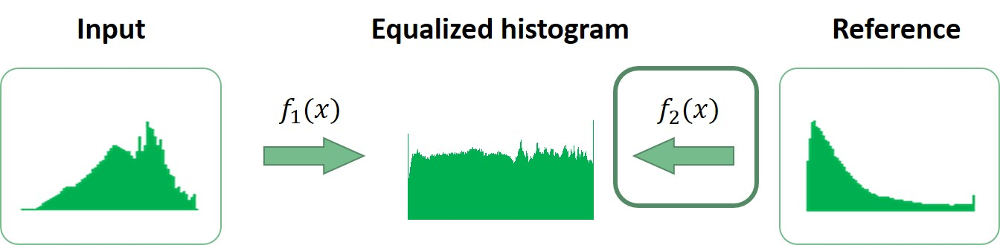
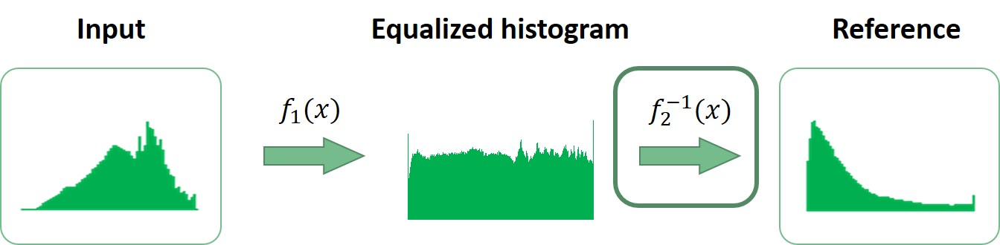
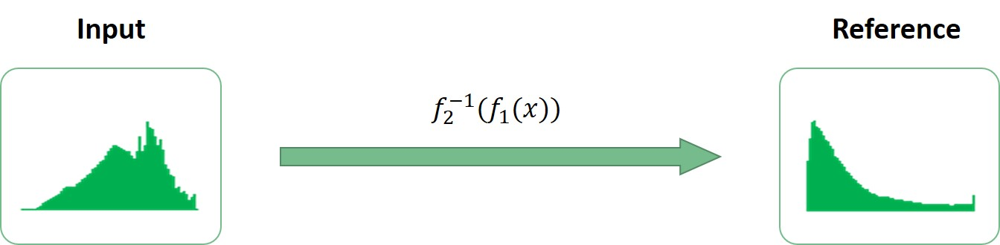
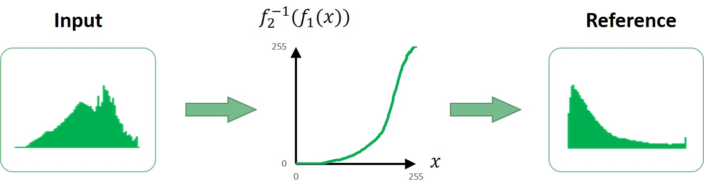

# Color style transform
This is one of my favorite projects since the visual effect is amazing and it's straight forward to implement, more often there're situations where image analysts might have the need to find a mapping function to have the two images look similar, in this case this project helps a lot by saving times and providing reasonable result:

    
   
    

# Implementation
The implementation of color style transformation is actually the extension of the famous "Histogram equalization", oftentimes having a good fundation is crucial to achieve great things.  
 
**Mapping**  
The way color style transformation is implemented is by generating the mapping function for each R/G/B channel from input to reference image automatically, once the distribution of histogram is approximately the same, so does color style:

    
   
    

**Extention of histogram equalization**  
The purpose of histogram equalization is to have the histogram uniformly distributed to increase the contrast of the image, although the bit depth for pixel intensity is discrete, the transformation is approximately uniform but is enough for the application, so the first step is to transform both the input and reference images to have approximately the same histogram distribution:

    
   
    

**Inverse mapping**  
Once we have the forward mapping from reference image to histogram equalized image, then we can approximate the inverse mapping too, one trick here is to rememorize the fact the function inverse is actually the 45 degree mirror image of forward mapping:

    
   
    

**Function composition**  
Thing has become clear in this stage, we could now apply a mapping from input to equalized image, and further apply the mapping from equalized image to reference image, and these two mapping could be composed into one transformation:

    
   
    

**Final result**  
Here's a visualization of the function composition, this could also be useful for analyzing the differences between the two images in situation where the differences is hard to distinguish by visual perception:

    
   
    

